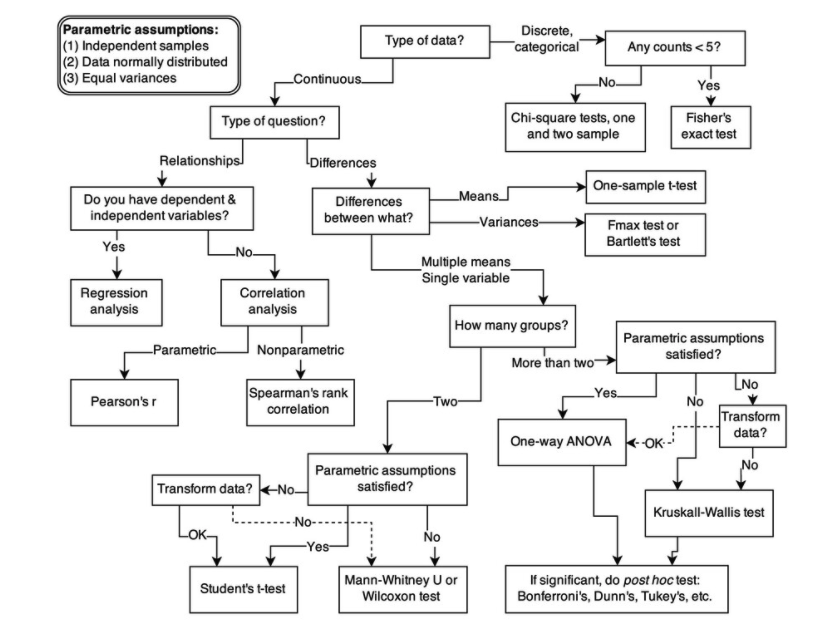
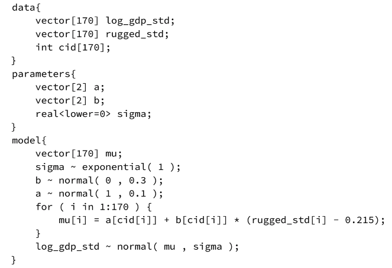
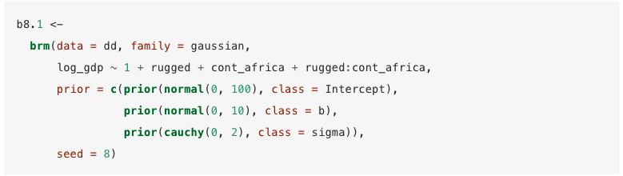
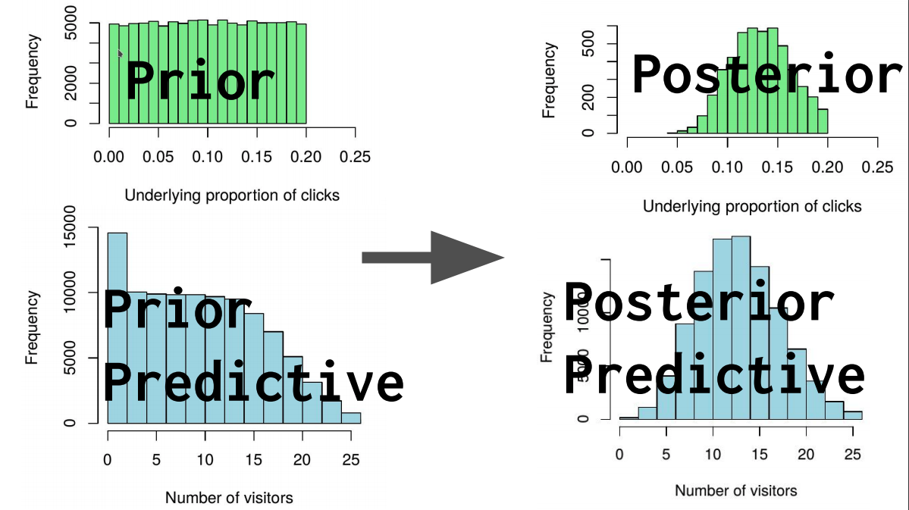

## What's the Bayesian Hype About?
--

* **Rethinking of statistical ideas**:
  * Use *probability* to describe uncertainty/risk
  * Ability to incorporate institutional knowledge
  * Increased modeling flexibility
--


**+**

* **Hardware and Software advances**:
  * Faster CPUs
  * Successes in moving computations to GPUs
  * Established Probabilistic Languages (Stan, PyMC3 and others)
--


**+**

* **Increasing industry success stories:**
  * Facebook (time series forecasting)
  * Uber (churn)
  * Baker Hughes (preventive maintenance)
  * A/B Tests
  * Sports Analytics
  * Healthcare industry

--

### Probabilistic Revolution in ML? Probably!

---
## Disadvantages of Probabilistic Models
<br/><br/>
* Very slow (still) vs. traditional ML.
  * Try running Prophet with mcmc_samples = 1000 vs. the default.
* More skill-intensive vs. traditional ML.
* Trickier to deploy (but getting there).


---


## When to use Probabilistic Models
<br/><br/>

--

### The sweet spots are:
* When **risk/uncertainty estimation** is crucial.
* When **insights** are more important than prediction.
* When data is relatively **small** or model runtime is not very important.

---
## Bayesian Data Analysis TLDR

<br/><br/>

<span style="font-size:1.5em;">State your assumptions. Get data. Count all the ways data can happen, according to assumptions.</span>

<span style="font-size:1.5em;">Assumptions with more ways that are consistent with data are more plausible.</span>

---



---
## Bayesian Terminology

--

### Everything is a [distribution!](https://seeing-theory.brown.edu/probability-distributions/index.html)
* Priors, Likelihoods and Posteriors. 
  * Conjugate?! priors
  * Bayesian Updating!?

--

### Monte Carlo Markov Chains (MCMC)
* The BBB (Bayesian Black Box)
* If you know backpropagation, you know the main idea.

--

### Some similar but different terms:
* Credible Intervals
* ROPE (Region of Practical Equivalence) - significance testing
* PD (Probability of Direction)
* Bayes Factor - hypothesis testing
* Maximum a posteriori probability (MAP) estimate (known as the mode, kind of like Maximum Likelihood)
---
## Bayesian Data Analysis - Modeling

<span style="font-size:1.5em;"> Main task - describe the world in probability distributions.</span>

--

**↓**

<span style="font-size:1.5em;">Two inputs: beliefs/assumptions before we get some new data, and the data.</span>

--

**↓**

<span style="font-size:1.5em;">Go into a BBB (Bayesian Black Box).</span>

--

**↓**

<span style="font-size:1.5em;">Returns Revised Beliefs that incorporate what we know before we got the data + the data.</span>


---

## Probability languages - Stan & Rstan & PyMC3 

### Provide a library of what's needed:

--

* Random variables and probability distributions that you can compose together to describe your problem.
* Well designed, fast implementations of Bayesian Black Box (Monte Carlo Markov Chains).


--
<br/>
<br/>
### Your main job is to describe the world well and push a button


---
## Stan code example (C++ under the hood)

---
## Same code in brms (R interface to Stan)



---
class: inverse, center, middle

# Example time - Ads Analytics
---
<br/>
## We are a small local wine-focused media - *Fermentation Times*
## We want to advertise on the Metabook social media
## We want to know:
1) How many visitors/clicks will we get out of a 100 shown adds.

2) Will we get more than 5 clicks/visitors?
---
class: middle, center
# Metabook's claim - We should expect 10% click rate.
---
class: middle, center
# A function simulating people clicking on 100 ads with an underlying rate of 10%?
--

# Binomial Distribution
---

# Let us simulate data

```{r, echo = FALSE}
set.seed(2021)
```

.pull-left[
```{r}
n_visitors <- rbinom(
  # Simulate 100K times
  n = 100000, 
  # Number of ads
  size = 100,
  # Probability of click
  prob = 0.1 
)

mean(n_visitors > 5)
```
]

.pull-right[
```{r, echo=FALSE}
hist(n_visitors, 
     xlab = 'Number of visitors',
     main = 'Distribution of clicks out of 100 ads views',
     breaks = 25,
     col = rgb(1,0,0,0.5))
```
]

---
## So far
* Represented uncertainty over future data with probability
* Worked with samples
---

## Simulation model
```{r, echo = FALSE}
set.seed(2021)
```

.pull-left[
```{r}
n_visitors <- rbinom(
  # Simulate 100K times
  n = 100000, 
  # Number of total ads views
  size = 100,
  # Probability of click
  prob = 0.1 
)

mean(n_visitors > 5)
```
]

.pull-right[
```{r, echo=FALSE}
hist(n_visitors, 
     xlab = 'Number of visitors',
     main = 'Distribution of clicks out of 100 ads views',
     breaks = 25,
     col = rgb(1,0,0,0.5))
```
]
---
## Simulation model + Prior
```{r, echo = FALSE}
set.seed(2021)
```

.pull-left[
```{r}
proportion_clicks <- runif(
  n = 100000, 
  min = 0.0, 
  max = 0.2
 )
```
<br/>
<br/>
<br/>
<br/>
<br/>
```{r}
n_visitors <- rbinom(
  n = 100000, 
  size = 100,
  prob = 0.1 
)
```
]

.pull-right[
.small[
```{r, echo=FALSE, fig.width=6,fig.height=4,dpi=300}
hist(proportion_clicks,
     main = 'Distribution of Click Probability\naka Prior (in this case - uniform)',
     xlab = 'Underlying proportion of clicks',
     col = rgb(0,0,1,0.5),
     breaks = 25
     )
```

```{r, echo=FALSE, fig.width=6,fig.height=4,dpi=300}
hist(n_visitors, 
     xlab = 'Number of visitors',
     main = 'Clicks out of 100 views',
     breaks = 25,
     col = rgb(1,0,0,0.5))
```
]
]

---
## Simulation model + Prior
```{r, echo = FALSE}
set.seed(2021)
```

.pull-left[
```{r}
proportion_clicks <- runif(
  n = 100000, 
  min = 0.0, 
  max = 0.2
 )
```
<br/>
<br/>
<br/>
<br/>
<br/>
```{r eval=FALSE}
n_visitors <- rbinom(
  n = 100000, 
  size = 100,
  prob = proportion_clicks 
)
```
]

.pull-right[
.small[
```{r, echo=FALSE, fig.width=6,fig.height=4,dpi=300}
hist(proportion_clicks,
     main = 'Distribution of Click Probability\naka Prior (in this case - uniform)',
     xlab = 'Underlying proportion of clicks',
     col = rgb(0,0,1,0.5),
     breaks = 25
     )
```

```{r, echo=FALSE, fig.width=6,fig.height=4,dpi=300}
hist(n_visitors, 
     xlab = 'Number of visitors',
     main = 'Clicks out of 100 views',
     breaks = 25,
     col = rgb(1,0,0,0.5))
```
]
]

---
## Simulation model + Prior = Prior Predictive Distribution
```{r, echo = FALSE}
set.seed(2021)
```

.pull-left[
```{r}
proportion_clicks <- runif(
  n = 100000, 
  min = 0.0, 
  max = 0.2
 )
```
<br/>
<br/>
<br/>
<br/>
<br/>
```{r}
n_visitors <- rbinom(
  n = 100000, 
  size = 100,
  prob = proportion_clicks 
)
```
]

.pull-right[
.small[
```{r, echo=FALSE, fig.width=6,fig.height=4,dpi=300}
hist(proportion_clicks,
     main = 'Distribution of Click Probability\naka Prior (in this case - uniform)',
     xlab = 'Underlying proportion of clicks',
     col = rgb(0,0,1,0.5),
     breaks = 25
     )
```

```{r, echo=FALSE, fig.width=6,fig.height=4,dpi=300}
hist(n_visitors, 
     xlab = 'Number of visitors',
     main = 'Updated Clicks out of 100 views\naka Prior Predictive Distribution',
     breaks = 25,
     col = rgb(1,0,0,0.5))
```
]
]

---
## Simulation model + Prior = Prior Predictive Distribution
```{r, echo = FALSE}
set.seed(2021)
```

.pull-left[
```{r}
proportion_clicks <- runif(
  n = 100000, 
  min = 0.0, 
  max = 0.2
 )
```
<br/>
<br/>
<br/>
<br/>
<br/>
```{r}
n_visitors <- rbinom(
  n = 100000, 
  size = 100,
  prob = proportion_clicks 
)

mean(n_visitors > 5)
```
]

.pull-right[
.small[
```{r, echo=FALSE, fig.width=6,fig.height=4,dpi=300}
hist(proportion_clicks,
     main = 'Distribution of Click Probability\naka Prior (in this case - uniform)',
     xlab = 'Underlying proportion of clicks',
     col = rgb(0,0,1,0.5),
     breaks = 25
     )
```

```{r, echo=FALSE, fig.width=6,fig.height=4,dpi=300}
hist(n_visitors, 
     xlab = 'Number of visitors',
     main = 'Updated Clicks out of 100 views\naka Prior Predictive Distribution',
     breaks = 25,
     col = rgb(1,0,0,0.5))
```
]
]
---

# So Far

* <span style="color:gray">Represented uncertainty over future data with probability</span>
* <span style="color:gray">Worked with samples</span>
* Represented prior uncertainty over parameters with probability
* Produced a prior predictive distribution over future data

---
class: middle, center
# No data yet - all results so far are based on prior information.
---
class: middle, center
# We finally decide to run 100 ads.
---
class: middle, center
# Bang! 
# 13 clicks out of 100 ads!
---
class: middle, center
# Bang!
# We got data now!
---
class: middle, center
# Now - just condition on the data.
---
class: middle, center
# Or plainly said - count the points that are consistent with the data.
---
## Conditioning on the data
```{r, echo = FALSE}
set.seed(2021)
```

.pull-left[
```{r}
prior <- 
  data.frame(
    n_visitors, 
    proportion_clicks
  )
```

```{r}
head(prior)
```

```{r eval = FALSE}
plot(prior)
```
]

.pull-right[
```{r echo = FALSE, warning = FALSE}
par(fig=c(0,0.8,0,0.8), new=TRUE)
plot(prior, col='darkgreen')
par(fig=c(0,0.8,0.55,1), new=TRUE)
hist(prior$n_visitors, breaks = 17, main = '', ylab = '', xlab='', yaxt='n', xaxt = 'n',col = rgb(1,0,0,0.5), xlim = c(0, 35))
par(fig=c(0.65,1,0,0.8), new=TRUE)
xhist <- hist(prior$proportion_clicks, plot=F, breaks = 17)
barplot(xhist$counts, horiz=TRUE, main = '', xlab='', yaxt='n', xaxt = 'n', col = rgb(0,0,1,0.5))
```
]

---
## Conditioning on the data

```{r echo = FALSE, warning = FALSE}
par(fig=c(0,0.8,0,0.8), new=TRUE)
plot(prior, col='darkgreen')
par(fig=c(0,0.8,0.55,1), new=TRUE)
hist(prior$n_visitors, breaks = 17, main = '', ylab = '', xlab='', yaxt='n', xaxt = 'n',col = rgb(1,0,0,0.5), xlim = c(0, 35))
par(fig=c(0.65,1,0,0.8), new=TRUE)
xhist <- hist(prior$proportion_clicks, plot=F, breaks = 17)
barplot(xhist$counts, horiz=TRUE, main = '', xlab='', yaxt='n', xaxt = 'n', col = rgb(0,0,1,0.5))
```


---
## Probability of click = 10%
```{r echo = FALSE, warning = FALSE}
prior_plot <- prior
prior_plot$col <- as.factor(prior$proportion_clicks > 0.098 & prior$proportion_clicks < 0.102)
par(fig=c(0,0.8,0,0.8), new=TRUE)
plot(prior, col=c('gray', 'darkgreen')[prior_plot$col], alpha = 0.1)
par(fig=c(0,0.8,0.55,1), new=TRUE)
hist(prior$n_visitors[prior$proportion_clicks > 0.098 & prior$proportion_clicks < 0.102], breaks = 17, main = '', ylab = '', xlab='', yaxt='n', xaxt = 'n',col = rgb(1,0,0,0.5), xlim = c(0, 35))
par(fig=c(0.65,1,0,0.8), new=TRUE)
xhist <- hist(prior$proportion_clicks, plot=F, breaks = 17)
xhist$col <- as.factor(xhist$breaks == 0.1)
barplot(xhist$counts, horiz=TRUE, main = '', xlab='', yaxt='n', xaxt = 'n', col = c( 'gray',rgb(0,0,1,0.5))[xhist$col])
```


---
## Probability of click = 13%

```{r echo = FALSE, warning = FALSE}
prior_plot <- prior
prior_plot$col <- as.factor(prior$proportion_clicks > 0.128 & prior$proportion_clicks < 0.132)
par(fig=c(0,0.8,0,0.8), new=TRUE)
plot(prior, col=c('gray', 'darkgreen')[prior_plot$col], alpha = 0.1)
par(fig=c(0,0.8,0.55,1), new=TRUE)
hist(prior$n_visitors[prior$proportion_clicks > 0.128 & prior$proportion_clicks < 0.132], breaks = 17, main = '', ylab = '', xlab='', yaxt='n', xaxt = 'n',col = rgb(1,0,0,0.5), xlim = c(0, 35))
par(fig=c(0.65,1,0,0.8), new=TRUE)
xhist <- hist(prior$proportion_clicks, plot=F, breaks = 17)
xhist$col <- as.factor(xhist$breaks == 0.13)
barplot(xhist$counts, horiz=TRUE, main = '', xlab='', yaxt='n', xaxt = 'n', col = c( 'gray',rgb(0,0,1,0.5))[xhist$col])
```

---
class: middle, center
# But that is not what we want! 
# We do not know what the proportion of clicks is!
---
class: middle, center
# We just know the data
# 13/100 clicks
---
## Conditioning on data - 13/100 clicks
```{r echo = FALSE, warning = FALSE}
prior_plot <- prior
prior_plot$col <- as.factor(prior$n_visitors == 13)
par(fig=c(0,0.8,0,0.8), new=TRUE)
plot(prior, col=c('gray', 'darkgreen')[prior_plot$col])
par(fig=c(0,0.8,0.55,1), new=TRUE)
upper_hist <- hist(prior$n_visitors, plot=F, breaks = 17)
plot(upper_hist, main = '', ylab = '', xlab='', yaxt='n', xaxt = 'n', col = c('grey',rgb(1,0,0,0.5),'grey')[cut(upper_hist$breaks, c(-Inf,11,13, Inf))], xlim = c(0, 35))
par(fig=c(0.65,1,0,0.8), new=TRUE)
xhist <- hist(prior$proportion_clicks[prior$n_visitors == 13], plot=F, breaks = 17, xlim = c(0, 0.2))
barplot(c(0,0,0,xhist$counts), horiz=TRUE, main = '', xlab='', yaxt='n', xaxt = 'n', col = rgb(0,0,1,0.5))
```

---


## Conditioning on data - 4/100 clicks
```{r echo = FALSE, warning = FALSE}
prior_plot <- prior
prior_plot$col <- as.factor(prior$n_visitors == 4)
par(fig=c(0,0.8,0,0.8), new=TRUE)
plot(prior, col=c('gray', 'darkgreen')[prior_plot$col])
par(fig=c(0,0.8,0.55,1), new=TRUE)
upper_hist <- hist(prior$n_visitors, plot=F, breaks = 17)
plot(upper_hist, main = '', ylab = '', xlab='', yaxt='n', xaxt = 'n', col = c('grey', rgb(1,0,0,0.5),'grey')[cut(upper_hist$breaks, c(-Inf,3,4, Inf))], xlim = c(0, 35))
par(fig=c(0.65,1,0,0.8), new=TRUE)
xhist <- hist(prior$proportion_clicks[prior$n_visitors == 4], plot=F, breaks = 17, xlim = c(0, 0.2))
barplot(c(xhist$counts, 0,0,0), horiz=TRUE, main = '', xlab='', yaxt='n', xaxt = 'n', col = rgb(0,0,1,0.5))
```

---
## The same in R code
.pull-left[
```{r}
prior <- 
  data.frame(
    proportion_clicks, 
    n_visitors)

posterior <- 
  prior[prior$n_visitors ==13,]
```

```{r eval=FALSE}
hist(posterior$proportion_clicks)
```

]
.pull-right[
```{r echo=FALSE, fig.width=6,fig.height=4,dpi=300}
hist(posterior$proportion_clicks, breaks = 17, col = rgb(0,0,1,0.5),
     xlab = 'Underlying proportion of clicks',
     xlim = c(0,0.3),
     main = 'Posterior'
     )
```

]


---
## Posterior to Predictive Posterior Distribution
.pull-left[
```{r eval = FALSE}
prior <- 
  data.frame(
    proportion_clicks, 
    n_visitors)

posterior <- 
  prior[prior$n_visitors ==13,]
```

```{r eval=FALSE}
hist(posterior$proportion_clicks)
```

```{r}
n_visitors_posterior_pred <- 
  rbinom(
    n = 100000,
    size = 100,
    prob = posterior$proportion_clicks
    )

```
]
.pull-right[
```{r echo=FALSE, fig.width=6,fig.height=4,dpi=300}
hist(posterior$proportion_clicks, breaks = 17, col = rgb(0,0,1,0.5),
     xlab = 'Underlying proportion of clicks',
     xlim = c(0,0.3),
     main = 'Posterior'
     )
```

```{r echo=FALSE, fig.width=6,fig.height=4,dpi=300}
hist(n_visitors_posterior_pred, breaks = 17, col = rgb(1,0,0,0.5),
     xlab = 'Number of visitors',
     main = 'Posterior predictive',
     xlim = c(0,30)
     )
```
]


---
## Predictive Posterior Distribution
.pull-left[
```{r eval = FALSE}
prior <- data.frame(
  proportion_clicks, 
  n_visitors)

posterior <- 
  prior[prior$n_visitors ==13,]
```

```{r eval=FALSE}
hist(posterior$proportion_clicks)
```

```{r eval = FALSE}
n_visitors_posterior_pred <- 
  rbinom(
    n = 100000,
    size = 100,
    prob = posterior$proportion_clicks
    )
```

```{r}
mean(n_visitors_posterior_pred > 5)
```

]
.pull-right[
```{r echo=FALSE, fig.width=6,fig.height=4,dpi=300}
hist(posterior$proportion_clicks, breaks = 17, col = rgb(0,0,1,0.5),
     xlab = 'Underlying proportion of clicks',
     xlim = c(0,0.30),
     main = 'Posterior'
     )
```

```{r echo=FALSE, fig.width=6,fig.height=4,dpi=300}
hist(n_visitors_posterior_pred, breaks = 17, col = rgb(1,0,0,0.5),
     xlab = 'Number of visitors',
     main = 'Posterior predictive',
     xlim = c(0,30)
     )
```
]

---

---

# So Far

* <span style="color:gray">Represented uncertainty over future data with probability</span>
* <span style="color:gray">Worked with samples</span>
* <span style="color:gray">Represented prior uncertainty over parameters with probability</span>
* <span style="color:gray">Produced a prior predictive distribution over future data</span>
* Bayesian inference by conditioning on the data
* Produced a posterior predictive distribution

---
# In Summary

## Probabilistic Models are coming and they are great:
* Especially when optimizing for insights and uncertainty estimation.
* Best with small-ish data.
* Improving tools in R & Python + Stan.
* Still rather slow, though.

--

## Probabilistic Models require statistical rethinking:
* Everything is a distribution.
* Describe (at least try to) the world, rather than just estimate/optimize your way.
* New terms, but less procedures overall.
* More work for the model builder, but worth it.


---
# Resources:

#### Start with Statistical Rethinking, Richard McElReath
* [Book, code and lectures in R and Stan](https://xcelab.net/rm/statistical-rethinking/)
* [Amazing companion in brms+tidyverse by S.Kurz](https://bookdown.org/content/4857/)

#### Regression and Other Stories, A. Gelman, J. Hill and A. Vehtari:
* [The book examples are in R](https://avehtari.github.io/ROS-Examples/examples.html)
* [Aki Vehtari's course](https://www.youtube.com/watch?v=AcKRob0C8EY&list=PLBqnAso5Dy7O0IVoVn2b-WtetXQk5CDk6&ab_channel=AkiVehtari) follows the book.

#### Shorter video lectures:
- Richard McElreath - [Bayesian Inference is Just Counting](https://www.youtube.com/watch?v=_NEMHM1wDfI&t=2802s&ab_channel=RichardMcElreath)
- Rasmus Baath - [Introducing Bayes - the basis for this talk](https://www.youtube.com/watch?v=Rvbs9OB2pa0&ab_channel=rasmusab)
- Paul-Christian Buerkner - [Why not to be afraid of prios (too much)](https://www.youtube.com/watch?v=Uz9r8eV2erQ&ab_channel=rasmusab)

#### Good blogposts and tutorials:
- [Easy R intro with bayestestR](https://easystats.github.io/bayestestR/articles/example1.html)
- [Nice post comparing frequentist to bayesian regression](http://haines-lab.com/post/on-the-equivalency-between-the-lasso-ridge-regression-and-specific-bayesian-priors/)
- [Sebastian Kurz blog - Every word of it!](https://solomonkurz.netlify.app/post/)
- [David Robinson's series of posts on baseball and Bayes](http://varianceexplained.org/statistics/beta_distribution_and_baseball/)


