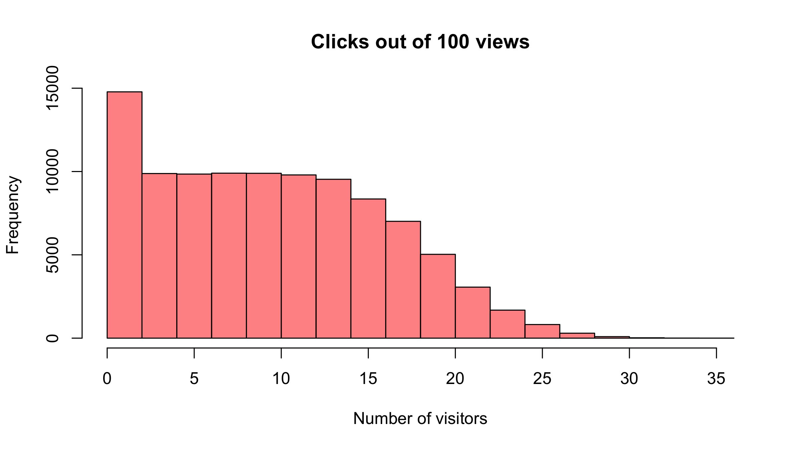

Intro to Bayesian Topics in 30 min
========================================================
author: Krum Arnaudov
date: 2021-11-20 (updated: 2021-11-21)
autosize: true
incremental: false


What's the Bayesian Hype About?
========================================================
<small>
* **Rethinking of statistical ideas**:
  * Use *probability* to describe uncertainty/risk
  * Ability to incorporate institutional knowledge
  * Increased modeling flexibility

**+**
* **Hardware and Software advances**:
  * Faster CPUs
  * Successes in moving computations to GPUs

**+**
* **Increasing industry success stories:**
  * Facebook (time series forecasting)
  * Uber (churn)
  * Baker Hughes (preventive maintenance)</small>
  
Bayesian Data Analysis TLDR
========================================================
type: section
<br/><br/>

<span style="font-size:1.5em;">Count all the ways data can happen, according to assumptions.</span>

<span style="font-size:1.5em;">Assumptions with more ways that are consistent with data are more plausible.</span>

Sounds easy, eh?
========================================================
type: section

Bayesian Terminology
========================================================
## Everything is a distribution!
* Priors, Likelihoods and Posteriors. 
  * Conjugate priors ??
  * Updating ??

## Monte Carlo Markov Chains
* Chains !?

## Some similar but different terms:
* Credible Intervals
* ROPE (Region of Practical Equivalence) - significance testing
* PD (Probability of Direction)
* Bayes Factor - hypothesis testing


We want to know
========================================================

- How many visitors/clicks will we get out of a 100 shown adds.
- Will we get more than 5 clicks/visitors?

Let us simulate data
========================================================


```r
n_visitors <- rbinom(
  # Simulate 100K times
  n = 100000, 
  # Number of total page views
  size = 100,
  # Probability of click
  prob = 0.1 
)

mean(n_visitors > 5)
```

```
[1] 0.94224
```
***

So Far
========================================================

* Represented uncertainty over future data with probability
* Worked with samples

========================================================


```r
n_visitors <- rbinom(
  n = 100000, 
  size = 100,
  prob = 0.1 
)

mean(n_visitors > 5)
```

```
[1] 0.94254
```
***


========================================================


```r
proportion_clicks <- runif(
 n = 100000, 
 min = 0.0, 
 max = 0.2)
```


```r
n_visitors <- rbinom(
  n = 100000, 
  size = 100,
  prob = 0.1 
)
```

***


========================================================


```r
proportion_clicks <- runif(
 n = 100000, 
 min = 0.0, 
 max = 0.2)
```


```r
n_visitors <- rbinom(
  n = 100000, 
  size = 100,
  prob = proportion_clicks
)
```

***




========================================================


```r
proportion_clicks <- runif(
 n = 100000, 
 min = 0.0, 
 max = 0.2)
```


```r
n_visitors <- rbinom(
  n = 100000, 
  size = 100,
  prob = proportion_clicks 
)
```


```r
mean(n_visitors > 5)
```

```
[1] 0.70413
```


***


So Far
========================================================

* Represented uncertainty over future data with probability
* Worked with samples
* Represented prior uncertainty over parameters with probability
* Produced a prior predictive distribution over future data


========================================================


```r
prior <- data.frame(n_visitors, proportion_clicks)
```


```r
head(prior)
```

```
  n_visitors proportion_clicks
1          9        0.07200833
2          4        0.04523047
3          4        0.03245836
4          5        0.05146508
5         13        0.11564031
6         12        0.09898077
```


```r
plot(prior)
```

***


========================================================


========================================================


========================================================


========================================================


```r
prior <- data.frame(proportion_clicks, n_visitors)

posterior <- prior[prior$n_visitors ==13, ]
```


```r
hist(posterior$proportion_clicks)
```


```r
n_visitors <- rbinom(
 n = 100000,
 size = 100,
 prob = posterior$proportion_clicks)

mean(n_visitors > 5)
```

```
[1] 0.97111
```

***


So Far
========================================================

* Represented uncertainty over future data with probability
* Worked with samples
* Represented prior uncertainty over parameters with probability
* Produced a prior predictive distribution over future data
* Bayesian inference by conditioning on the data
* Produced a posterior predictive distribution
