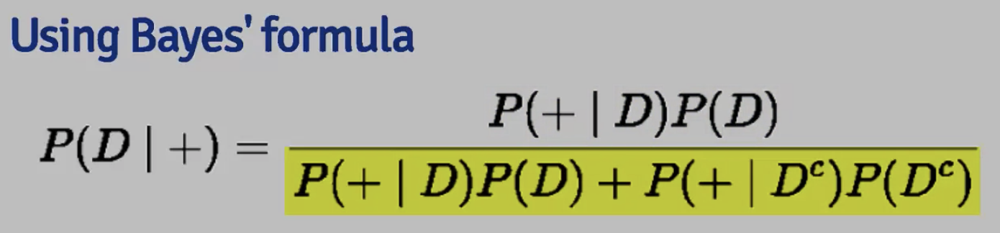
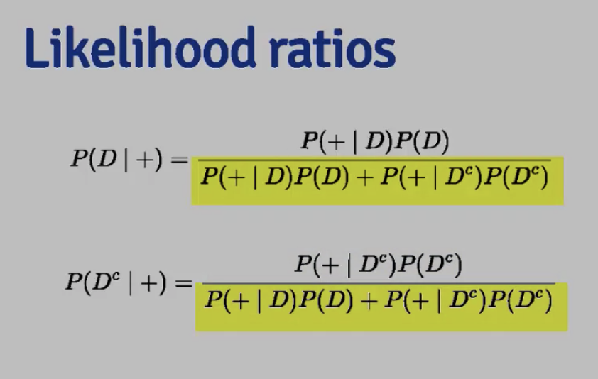

# Probability refresher

Reminder:

## Probability Mass Function (PMF) - A PMF evaluated at a value corresponds to the probability that a random variable takes that value. To be a valid PMD, a function p must satisfy:
1. It must always be larger than or equal to 0
2. The sum of the possible values that the random variable can take has to add up to one.

Example:
- Bernoulli PMF
X = 0 represents tails and X = 1 represents heads.

PMF = p(x) = theta^x(1-theta)^(1-x) for x = 0,1

Usually, we do not know theta - we will use the data to estimate it.

## Probability Density Function:
A probability mass function (PMF) gives the probability that a discrete random variable is exactly equal to some value.
1. It must always be larger than or equal to 0
2. The total area must sum up to one.

A probability density function is associated with a continuous random variable. To quote from Wikipedia, it "is a function that describes the relative likelihood for this random
variable to take on a given value. The probability of the random variable falling within a particular range of values is given by ... the area under the density function but
above the horizontal axis and between the lowest and greatest values of the range."
Example:

f(x) 2x for 0<x<1 otherwise 0

## Cumulative distribution function - the probability that a random variable, X, is less than or equal to the value x.

| When the random variable is continuous, as in the example, the PDF is the derivative of the CDF. So integrating the PDF (the line represented by the diagonal) yields the CDF.
| When you evaluate the CDF at the limits of integration the result is an area.

Remember in R `integrate(mypdf, lower = 0, upper = 1.6)`

Complement of CDF is called survivor function S(x)
pbeta, pnorm etc, in R
```{r}
pbeta(c(0.4, 0.5, 0.6), 2, 1)
```

## Quantiles - the ath quantile of a distribution with distribution function F is the point xa so that F(xa) = a

```{r}
qbeta(c(0.16, 0.25, 0.36), 2, 1)

#Population Median #Remember sample median vs. population median
qbeta(0.5, 2,1)
```

# Conditional Probability

- Let B be an event with proba > 0
- P(A|B) = P(A & B)/ P(B) . P(A|B) is the probability that BOTH A and B occur divided by the probability that B occurs.
- in independent, P(A|B) = P(A)

## Bayes Rule

P(B|A) = P(B&A)/P(A) = P(A|B) * P(B)/P(A). This is a simple form of Bayes' Rule which relates the two conditional probabilities.

We can substitue P(A) = P(A|B) * P(B) + P(A|~B) * P(~B)
P(B|A) but we have P(A|B)




The diagnostic likelihood ratio of a positive test, DLR_+, is the ratio of the two + conditional probabilities, one given the presence of disease and the other given the
absence. Specifically, DLR_+ = P(+|D) / P(+|~D). Similarly, the DLR_- is defined as a ratio.

Random variables are said to be iid if they are independent and identically distributed. By independent we mean "statistically unrelated from one
another". Identically distributed means that "all have been drawn from the same population distribution".

```{r}
sensitivity_hiv <- 0.997 #P(+| D)
specificity_hiv <- 0.985 #P(-| No D)
prevalence_hiv <- 0.001

get_disease_test <- 
  function(sensitivity_test, 
           specificity_test,
           prevalence_dis){
    
    d_given_positive = (sensitivity_test*prevalence_dis)/((sensitivity_test*prevalence_dis + (1 - specificity_test)*(1 - prevalence_dis)))
    not_d_given_negative = (1 - specificity_test)*(1 - prevalence_dis)/((sensitivity_test*prevalence_dis + (1 - specificity_test)*(1 - prevalence_dis)))
    
    c(d_given_positive, not_d_given_negative)
    cat(cat("Probability of disease given positive result:", d_given_positive), cat("\nProbability of not having a disease given negative result:", not_d_given_negative ))
  }

get_disease_test(sensitivity_hiv, specificity_hiv, prevalence_hiv)

sens_preg <- 0.75
spec_preg <- 0.52
prev_preg <- 0.3
get_disease_test(sens_preg, spec_preg, prev_preg)
```

# Expected Values

The expected value of a random variable X, E(X), is a measure of its central tendency. For a discrete random variable X with PMF p(x), E(X) is defined as a sum, over all
possible values x, of the quantity x*p(x). E(X) represents the center of mass of a collection of locations and weights, {x, p(x)}.

The expected value or mean of the sample mean is the population mean. What this means is that the sample mean is an unbiased estimator of the population mean.

Remember a simulation - a distribution of sample means will be centered around the population mean and will have a variance dependent on sample size

```{r}
library(swirl)
install_from_swirl("Statistical Inference")
```
```{r}
x <- 1:4
p <- x/sum(x)
temp <- rbind(x, p)
rownames(temp) <- c("X", "Prob")
temp
```
Hospital, 400 patients admitted over a month for heart attacks. A month later, 72 dead, 328 survived.

Disregarding sampling issues:
Y ~ Bernoulli(theta)
P(Yi=1) = theta
PDF = P(Y =y|theta) = P(Y1 = y1, Y2 = y2 ....|theta) = 
= P(Y1 = y1)*... = Produt(P(Yi  = yi|that)) = Product theta^yi*(1-theta)^(1-y)

Likelihood = L(theta|y) - difference to the above - the inverse of PDF. Function of theta, given Y. 
MLE - Choose theta that gives the largest likelihood for Y. Makes the data most likely to occur, given the data we have.
In practice, the log likelihood is easier to maximize. (when we maximize the log, we maximize the original function).

CLT can give us an approximate confidence interval - theta_hat +- 1.96*sqrt(theta_hat(1-theta_hat)/n)
```{r}


```

